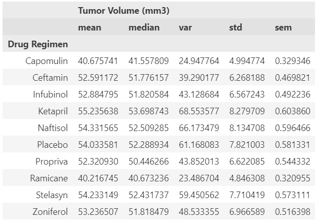
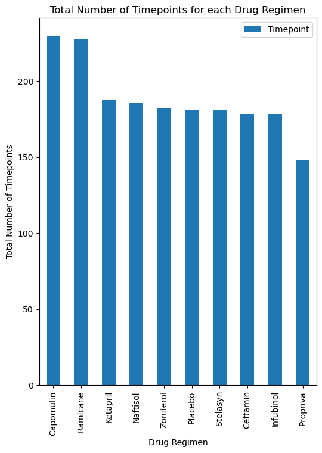
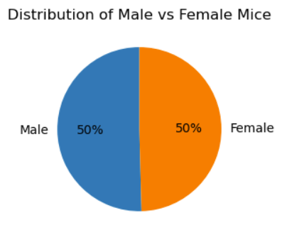
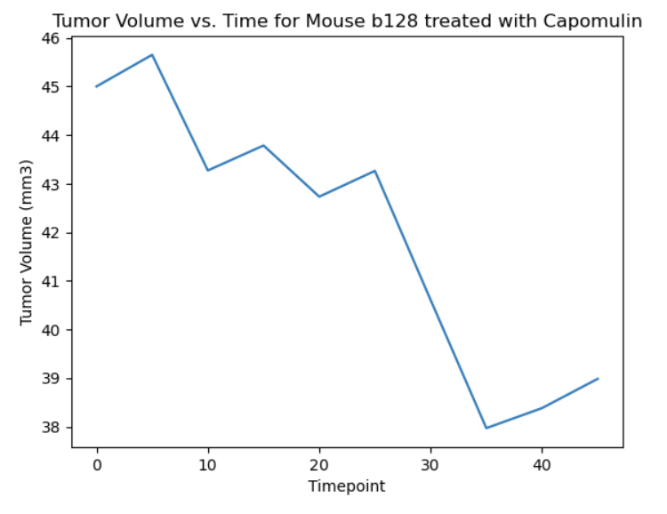
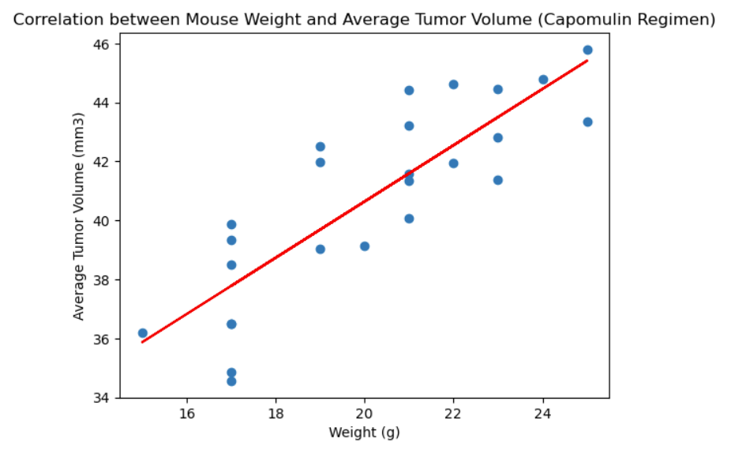
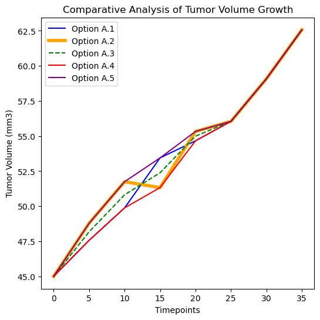

# plot-challenge
 Pymaceuticals, Inc - Technical Report
by Alberto Ponce

## Analysis Background

Cancer is a complex and often devastating disease that affects millions of people worldwide. Among the various forms of cancer, squamous cell carcinoma (SCC) is one of the most commonly occurring types of skin cancer. Pymaceuticals, Inc. is a new pharmaceutical company that specializes in developing anti-cancer medications, and has recently begun screening for potential treatments for SCC.

 In this study, 249 mice with SCC tumors were treated with a range of drug regimens, including Pymaceuticals' drug of interest, Capomulin. The study's purpose was to compare the performance of Capomulin against other treatment regimens over a period of 45 days, during which tumor development was observed and measured.

The following analysis aims to provide a comprehensive overview of the study's findings, highlighting the performance of Capomulin and other treatment regimens in reducing tumor growth in SCC-afflicted mice.

 ## Executive Summary 

Of the drug regimens, Capumulin placed within the percentage of regimens that produced at least 10 timepoints per patient, as well as being tested in the most patients. The closest competitor within this study was the drug regiment Ramicane.

In terms of tumor volume, Capomulin excelled at keeping the tumor small, almost twice as small as the competitors. The closest competitor within this parameter was also Ramicane. 

In terms of tumor volume and weight, Capomulin seemed to have more control on the tumor size with patients over 18g.

## Study Charts

## Capomulin Charts

## Methodology 

### Cleaning the data

As part of the intial step of analysis, we have encountered duplicated patient information. The following methodology was initiated to review the duplicated patient and other biases within the raw data files. 

#### Observations while grouping by Timepoints and Mouse ID

There are 249 unique mouse patients, only of which 130 mouse ID's can be identified with the sum of all timepoints to be 225. These entries will be classified as "reported" with high confidence that 100% of the timepoint data was collected. In terms of percentages, **52% of the unique number of patients have all 10 timepoints logged in the data portal.**

> **logic** : of 249 mouse patients, and 10 timpoints each ( 0-45 in increments of 5), there should be about 2490 entries to the patient data. 

There is currently only 1893 entries to the patient data entries, indicating there are some entries that were not reported. The incomplete timepoint entries will be classified as "review" patients, to indicate that some QAQC might be needed. 

#### Data Cleaninig Conclusions

While this analysis is looking at the effectiveness of the drug regimen, it is important to notate that a little over half of the patients had all 10 timepoints documented. This could potentially hint at the rate of survival of the patients, information that is not documented here. 

This particular case of Propiva that was over documented raises concerns not about the end result (after timepoint #25, all cleaning options align), but of the tumor growth and metastatic site observations. 

For example, if we choose option A.2, which is to drop the second duplicated item, the graph documents how the tumor volume actually shrinks before metastasicing. It would be prudent to contact the laboratory techicians to ensure the methodology and results match with the initial intent of the study. 

>**However, the study methodology selected was to drop the duplicated patient, leaving the study with only 248 patients to graph and chart.**

